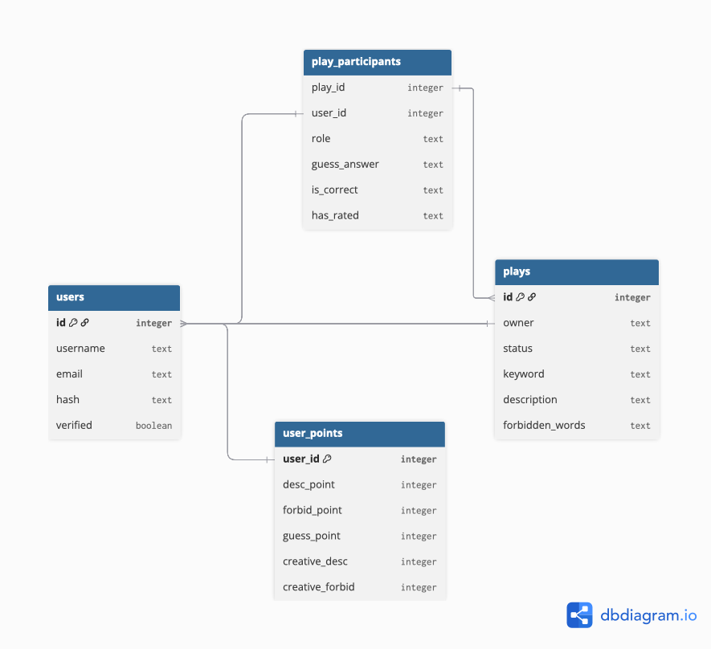

# 4Describid
#### Video Demo:  <URL HERE>
#### URL: https://fourdescribid.onrender.com

## What is 4Describid?
A multiplayer word-guessing web game where players choose a role that either help or hinder others from reaching the answer.

## What the game is about?

4Describid is a game of competing strategies. 
Each role is designed to make equal impact on the play.
There are two sides in this competition. The first is the describer and up to 10 guessers. They must make sure the message conveys well. Their goal: everyone reaches the correct keyword.
    The other side won't allow that. We call them the forbidders. 
They will strip away valuable words from the describer. Causing as much detour and ambiguation in the message as much as they can. The 'forbidder' is crucial and unique to this game. With so little action but so much importance to the flow.

## Features

You'll be greeted by register and login system. Only one account per email is allowed. 

After logging in, you'll first see: 
    
### - Your profile page:
Locating on the left panel are your own describids, aka, 
the "play" that you have created. You can also check and follow up any plays that you have ever participated on the right side panel

Other features can be accessed through the nav bar.

### - Create new:
create your new play, generate a keyword and post it for others to participate.

### - Explore:
This page allows you to participate in other's plays. There are two subtabs. 
#### 1. The forbid play tab: 
Click to view the keyword, and become the forbidder by submitting 'forbidden words'. Think carefully before you submit. The impact they have on the description is very much bigger than you think.

#### 2. The guess play tab:
 Make your guess here. 
The only thing you'll see here is the description provided by the describer. You won't see the keyword (of course) or any of the forbidden words.

### - Play:
- Each play is identified by a unique id.
- User can access this page from multiple places, ie, profile, explore, etc.
- Different sections of the play will be displayed or hidden according to the user role.
- If the user decide to participate, their action will determine the play, or change their role accordingly. Everything is updated into relevant tables in the database.

### - History:
Check all of the concluded plays here. All of them. Nothing is lost in 
this web app. :)

## First Use Recommendation

After logging in, try creating your new play, when you post it for the first time, there's nothing you can do for a while,
proceed to explore page. Hopefully, there'll be some other plays already displayed. I myself will make sure to participate as a player and supply the board frequently.
Just play around, submit some forbidden words, submit some guess.

Go back to your profile, you can rest here and wait for the update. Also, for any play that you have participated, you can quickly find them here too.

There are 3 types of points. For the describer and guesser, you will get the point if you contribute to increase the number of correct guesses. For the forbidder, you will get point by the number of people who (that you duohandedly cause them to) make a wrong guess.

Please note, anyone who knows the keyword can never be the guesser. Make sure to not click "View the keyword" if you plan to guess a play from a particular user.

## Project Structure

This web app has a total of 7 pages / routes.

- index (profile)
- register
- login
- create new
- explore
- play
- history

The entirety of the project is built upon Flask framework.
There are 3 javascript files, a css file.
All server data are saved in finance.db file which contains 4 tables as per image below.

## APIs in the project

- Resend: I use this API for email verification. Upon register, the user will receive an email via their registered email. One account per email to prevent one user from owning too many account.
For some reason, Hotmail blocks all emails from my web app. Therefore, I recommend register with Gmail if possible.
- Wordnik: As for the mechanic of random words generator, I rely on Wordnik to get a set of nouns. With their statistics of commonness of English word, I can control the words to not be too common or too rare.

## Personal Take

I would like to dedicated this space to thank CS50 team.
For giving me knowledge of basic computer science, especially Flask framework.
This is my first time ever learning it and I am already be able to build a web app this complex
while having so much fun.
    I did make sure to be mindful of anti-hack practice such as, Server-side verification, SQL injection prevention, and hash password. Still, I'm just a guy with no background in security. Please don't input any sensitive information into the database. Especially, if you're gonna register with your real email.

