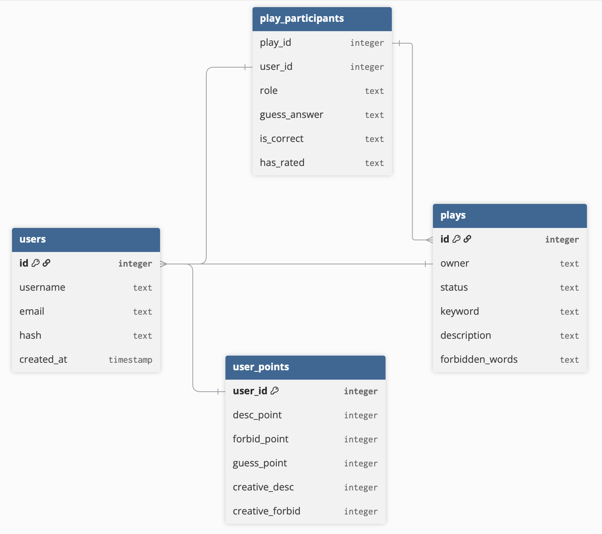

# 4Describid
#### Video Demo:  <URL HERE>

## What is 4Describid?
A multiplayer word-guessing web game where players choose a role that either help or hinder others from reaching the answer.

## What the game is about?

4Describid is a game with game theory. 
Each role is designed to make equal impact on the play.
There are two sides in this competition. The first is the describer and up to 10 guessers. They must make sure the message conveys well. Their goal: everyone reaches the correct keyword.
    The other side won't allow that. We call them the forbidders. 
They will strip away valuable words from the describer. Causing as much detour and ambiguation in the message as much as they can. The 'forbidder' is crucial and unique to this game. With so little action but so much importance to the flow.

## Features

You'll be greeted by register and login system. One account per email. 

After logging in, you'll first see: 
    
### - your profile page:
Locating on the left panel are your own describids, aka, 
the "play" that you have created. You can also check and follow up any plays that you have ever participated on the right side panel

Other features can be accessed through the nav bar.

### - Create new:
create your new play, it will cost you one action token for each word you
generated, as you shall soon seen, all playing actions have token to limit what you can do per day as well as encourage you to diversify to other types of action.

### - Explore:
This page allows you to participate in other's plays. There are two subtabs. 
#### 1. The forbid play tab: 
Click to view the keyword, and become the forbidder by submitting 'forbidden words'. Think carefully before you submit. The impact they have on the description is very much bigger than you think.

#### 2. the guess play tab:
 Make your guess here. 
The only thing you'll see here is the description provided by the describer. You won't see the keyword (of course) or any of the forbidden words.

### - History:
Check all of the concluded plays here. All of them. Nothing is lost in 
this web app. :)

Check the project diagram here. -->

## First Use Recommendation

After logging in, try creating your new play, when you post it for the first time, there's nothing you can do for a while,
proceed to explore page. Hopefully, there'll be some other plays already displayed. I myself will make sure to participate as a player and supple the board frequently.
Just play around, submit some forbidden words, submit some guess.

Go back to your profile, you can rest here  and wait for the update as ... any play you pp , it will always stay here

There are 3 types of points. For the des and guess, you will get the point if you play a part and contribute to increase the number of correct guesses. For the forbid points, you will get point by the number of people (that you duohandedly cause them to) that make a wrong guess.

## Project Structure

This web app has a total of 7 pages / routes.

- index (profile)
- register
- login
- create new
- explore
- play
- history

The entirety of the project is built upon Flask framework.
There are 3 javascript files, a css file.
All server data are saved in finance.db file which contains 4 tables as per image below.

## How It Works

Create New:
- API query to get a random noun from wordnik.
- Insert a new play into database, fill in status and other mandatory infos.

Play:
- User can access this page from multiple places, ie, profile, explore, etc.
- Different sections of the play will be displayed or hidden according to the user role.
- If the user decide to participate, their action will determine the play, or change their role accordingly. Everything is updated into relevant tables in the database.

I have done multiple tests to make sure anyone who knows the keyword can never be the guesser. For good user, some plays will not be shown in some places depending on your role on those plays. For malicious user, my webapp has server side verification and is injection-proof. You are welcome to try those attacks. :)

## Inspiration

I would like to dedicated this space to thank CS50 team.
For giving me knowledge of basic computer science, especially Flask framework.
This is my first time ever learning it and I am already be able to build a web app this complex
while having so much fun.
    I can pretty much design this project freely with little concern because I feel 
powerful enough to be able to research any with what CS50 had given.

Thank you from the bottom of my heart.

## Design choice

- What logic do I need in flask and SQL to support an app where several roles view the same thing differently? 
- How many database tables are least required to record the status of the flow of that many players?
- Can one single page submit a post request of different types?

## Acknowledgments/Credits
For get_random_noun , I used ai as I have no knowledge for api
as well as ajax